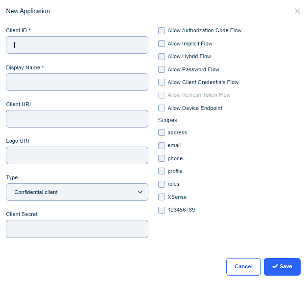

## API Keys

An API key is used to identify and authenticate an application. They act as unique identifiers and provide a secret token for the authentication process. The APIs are the interface that helps the XSense Server communicate with the XSense CPP application and ThinC Manager.

* To generate a new key, navigate to API keys under the Applications section. Click on New API Key and provide the Name of the API key and a key value. The key value can be alphanumeric and contain special characters. Click on save.



### ThinC Manager Installation with API Config file

Download the API config file and place the API config file in the same folder of the ThinC Manager installer. Once the ThinC Manager installation is initiated, the installer will automatically fetch the available API config and complete the installation.

### XSense CPP Installation with API Config file

Place the API config file in the same folder of the XSense CPP installer. Once the XSense CPP installation is initiated, the installer will automatically fetch the available API config and complete the installation.

## OpenID

OpenID is an open standard and decentralized authentication protocol that enables users to log in to multiple websites and applications using a single set of credentials. OpenID is a simplified identity layer implemented on top of the OAuth 2.0 protocol. The OpenID protocol allows users to authenticate themselves with an OpenID provider, such as XSense Server,Google or Facebook. After being verified, the user is given a special ID called an OpenID, which they can use to log into any number of websites that use OpenID authentication through XSense with multi-factor authentication.

With OpenID, users can enjoy the convenience of using a single set of login credentials across multiple platforms, reducing the burden of remembering multiple usernames and passwords. XSense Server offers  more secure / multi-factor authentication techniques, lowering the danger of password-related vulnerabilities such weak passwords or password reuse. The administrator can add several applications to enable multi-factor authentication from the XSense dashboard.

* To add a application, click on **New Application**.

* Enter the required details and choose the necessary scopes for the application and click on **Save**.

## OpenID Scopes

In the context of OpenID, scopes refer to the permissions or access rights requested by an application when authenticating a user. Scopes determine the level of information and functionality that an application can access on behalf of the user.

When a user attempts to authenticate with an OpenID provider, the application requesting authentication can specify the scopes it requires. These scopes typically correspond to specific user attributes or resources that the application needs to access. For example, a social media application may request access to the user's profile information, friends list, or post updates on their behalf.

The OpenID provider then presents the requested scopes to the user during the authentication process, informing them about the level of access the application is requesting. The user can review and decide whether to grant the requested scopes or not. This ensures transparency and gives users control over the information they share with applications.

Scopes help protect user privacy by allowing users to limit the access an application has to their personal data. Users can grant or deny scopes based on their trust in the application and their comfort level with sharing certain information.

OpenID supports a range of standard scopes, such as profile information, email address, offline access, and specific application-defined scopes. The availability of scopes may vary depending on the OpenID provider and the configuration of the application.

In summary, scopes in OpenID define the extent of access an application has to a user's data and resources. They provide users with control over the permissions granted to applications during the authentication process, ensuring a balance between convenience and privacy.

* adfasdfaf

a
* adfadf

## SAML

* okj;kj;

  

* adsfadsfasdf

  

* adfafd

  

  
